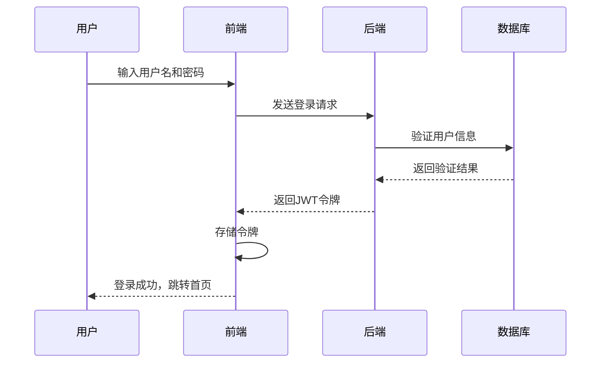

# 📚 RFID档案管理系统

<div align="center">


<br/>


[快速开始](#-快速开始) • 
[系统架构](#-系统架构) • 
[功能特性](#-功能特性) • 
[技术栈](#-后端技术栈-springboot) • 
[演示体验](#-系统截图) • 
[联系作者](#-联系方式)

</div>

<hr/>

## 🔍 项目介绍

基于RFID技术的档案管理系统是一套完整的解决方案，用于实现档案的电子化管理、借阅、归还等操作。系统通过RFID技术实现档案的快速识别，结合Web应用提供直观的用户界面，使档案管理工作更加高效、便捷和安全。

系统由三大核心组件组成，形成完整的数据流和业务闭环：

<table>
<tr>
<td width="33%" align="center"><b>📱 前端 (Vue)</b><br/>用户交互与可视化展示</td>
<td width="33%" align="center"><b>⚙️ 后端 (SpringBoot)</b><br/>业务逻辑处理与数据持久化</td>
<td width="33%" align="center"><b>🔌 硬件 (STM32)</b><br/>RFID读取与数据采集</td>
</tr>
<tr>
<td><a href="VUE/README.md">前端详情</a></td>
<td><a href="SpringBoot/README.md">后端详情</a></td>
<td><a href="STM/README.md">硬件详情</a></td>
</tr>
</table>

## 📋 目录

- [项目介绍](#-项目介绍)
- [系统架构](#-系统架构)
- [功能特性](#-功能特性)
- [后端技术栈](#-后端技术栈-springboot)
- [硬件技术栈](#-硬件技术栈-stm32)
- [前端技术栈](#-前端技术栈-vue)
- [快速开始](#-快速开始)
- [系统截图](#-系统截图)
- [联系方式](#-联系方式)
- [许可协议](#-许可协议)

## 🏗️ 系统架构

<details open>
<summary><b>整体架构设计</b></summary>

系统采用了分层的架构设计，包括数据采集层、业务处理层和用户交互层三个主要层次，各层之间通过标准化接口进行通信。

```
┌─────────────────────────────────────────────────────────────┐
│                       用户交互层 (Vue)                        │
│                                                             │
│  ┌───────────┐  ┌───────────┐  ┌───────────┐  ┌───────────┐ │
│  │ 用户认证   │   │ 档案管理   │  │ 借阅管理   │  │ 数据分析   │  │
│  └───────────┘  └───────────┘  └───────────┘  └───────────┘ │
└─────────────────────────────┬───────────────────────────────┘
                              │
                              ▼
┌─────────────────────────────────────────────────────────────┐
│                      业务处理层 (SpringBoot)                  │
│                                                             │
│  ┌───────────┐  ┌───────────┐  ┌───────────┐  ┌───────────┐ │
│  │ 用户服务   │   │ 档案服务   │  │ 借阅服务   │  │ 数据服务    │ │
│  └───────────┘  └───────────┘  └───────────┘  └───────────┘ │
│                                                             │
│  ┌───────────────────┐      ┌────────────────────────────┐  │
│  │    数据访问层       │      │          通信服务           │  │
│  │ (MyBatis + MySQL) │      │ (硬件接口 + RESTful API)    │  │
│  └───────────────────┘      └────────────────────────────┘  │
└─────────────────────────────┬───────────────────────────────┘
                              │
                              ▼
┌─────────────────────────────────────────────────────────────┐
│                      数据采集层 (STM32)                       │
│                                                             │
│  ┌───────────┐  ┌───────────┐  ┌───────────┐  ┌───────────┐ │
│  │ RFID读取   │  │ 数据处理   │  │ WiFi通信   │  │ 状态指示   │ │
│  │ (RC522)   │  │ (STM32)   │  │ (ESP8266) │  │ (蜂鸣器)   │ │
│  └───────────┘  └───────────┘  └───────────┘  └───────────┘ │
└─────────────────────────────────────────────────────────────┘
```
</details>

<details>
<summary><b>组件交互流程</b></summary>

以下是系统中主要组件之间的交互流程：

```
┌─────────┐    RFID信号    ┌─────────┐    SPI    ┌─────────┐
│  RFID卡 │──────────────▶│  RC522  │──────────▶│  STM32  │
└─────────┘                └─────────┘           └───┬────┘
                                                     │
                                                     │ UART
                                                     ▼
┌────────────┐   HTTP请求   ┌─────────┐    WiFi    ┌─────────┐
│ SpringBoot │◀────────────│  服务器  │◀───────────│ ESP8266 │
└──────┬─────┘              └─────────┘            └─────────┘
       │
       │ RESTful API
       ▼
┌─────────────┐
│   Vue前端    │
└─────────────┘
```
</details>

<details>
<summary><b>数据流向详解</b></summary>

系统数据流分为三个主要业务流程：

1. **档案识别流程** 📝
   - RFID卡片靠近RC522读卡器
   - RC522捕获卡片信号并通过SPI传输给STM32
   - STM32处理卡号数据，格式化为HTTP请求
   - 通过ESP8266 WiFi模块发送至SpringBoot后端
   - 后端处理请求并返回档案信息
   - 前端展示档案详情

2. **借阅流程** 📤
   - 用户在前端选择借阅功能
   - 用户刷RFID卡
   - 硬件捕获卡号并发送至后端
   - 后端验证卡号并处理借阅业务逻辑
   - 更新数据库借阅状态
   - 返回借阅结果至前端
   - 前端展示借阅成功/失败信息

3. **归还流程** 📥
   - 用户在前端选择归还功能
   - 用户刷RFID卡
   - 系统验证卡号并处理归还业务逻辑
   - 更新借阅记录和档案状态
   - 前端展示归还成功/失败信息
   </details>

<details>
<summary><b>安全机制</b></summary>

系统采用多层次安全保障措施：

- 🔐 **用户认证**：基于JWT的身份验证
- 🔒 **数据传输**：HTTPS加密
- 👮 **权限控制**：基于角色的访问控制(RBAC)
- 🛡️ **数据存储**：密码加密存储
- 📝 **操作审计**：关键操作日志记录
</details>

## ✨ 功能特性

<details open>
<summary><b>🔐 用户管理</b></summary>

- **用户注册与登录**
  - 基于角色的账户系统（管理员、普通用户）
  - 安全的密码存储（BCrypt加密）
  - JWT令牌认证
  - 用户会话管理

- **个人信息管理**
  - 用户基本资料维护
  - 头像上传与修改
  - 密码修改与重置

- **权限控制**
  - 基于角色的访问控制
  - 操作审计日志
  - 敏感操作二次验证
  </details>

<details>
<summary><b>📚 档案管理</b></summary>

- **档案信息录入**
  - 档案基本信息录入（名称、作者、日期等）
  - 档案分类与标签管理
  - 档案位置管理
  - RFID卡绑定

- **档案编辑与维护**
  - 档案信息批量导入/导出
  - 档案信息更新
  - 档案状态管理（在库、借出、维护中）
  - 档案封面图片上传

- **档案分类管理**
  - 多级分类体系
  - 自定义分类创建
  - 档案分类统计

- **档案位置管理**
  - 区域和位置编码
  - 位置快速查询
  - 位置变更记录
  </details>

<details>
<summary><b>📑 借阅管理</b></summary>

- **RFID刷卡借阅**
  - 一键式借阅流程
  - 自动身份验证
  - 借阅权限检查
  - 借阅期限设置

- **借阅历史记录**
  - 个人借阅历史查询
  - 档案借阅记录查询
  - 借阅状态实时更新
  - 超期提醒

- **归还管理**
  - RFID刷卡归还
  - 归还状态确认
  - 超期费用计算
  - 归还评分（档案评价）

- **借阅规则设置**
  - 不同用户类型的借阅权限设置
  - 最大借阅数量限制
  - 借阅期限自定义
  - 超期处理规则
  </details>

<details>
<summary><b>📊 统计分析</b></summary>

- **借阅数据可视化**
  - 借阅量时间趋势图
  - 热门档案排行榜
  - 用户活跃度分析
  - 借阅周期分析

- **档案类型分布**
  - 不同类型档案数量统计
  - 档案年代分布
  - 档案利用率分析
  - 馆藏结构评估

- **用户行为分析**
  - 用户借阅偏好分析
  - 用户群体画像
  - 借阅时段分析
  - 用户忠诚度指标

- **系统运营报表**
  - 定期数据报表生成
  - 关键指标监控
  - 异常情况预警
  - 运营决策支持
  </details>

<details>
<summary><b>🔍 搜索功能</b></summary>

- **多条件组合搜索**
  - 按档案名称/作者/时间搜索
  - 按分类/标签筛选
  - 按位置查询
  - 按状态过滤

- **高级检索**
  - 全文检索
  - 模糊匹配
  - 关联推荐
  - 搜索历史记录
  </details>

<details>
<summary><b>🔔 通知与提醒</b></summary>

- **借阅到期提醒**
  - 到期前邮件提醒
  - 到期前系统通知
  - 超期警告

- **系统公告**
  - 重要通知发布
  - 系统维护提醒
  - 新功能介绍
  </details>

## 🚀 后端技术栈 (SpringBoot)

<details open>
<summary><b>核心技术</b></summary>

### 技术架构

```
┌───────────────────────────────────────────────────────────┐
│                    Spring Boot应用                         │
│                                                           │
│  ┌─────────────┐  ┌──────────────┐  ┌───────────────────┐ │
│  │  控制器层    │  │   服务层      │  │     数据访问层      │ │
│  │ Controllers │  │  Services    │  │   Repositories    │ │
│  └─────────────┘  └──────────────┘  └───────────────────┘ │
│          │               │                   │            │
│          └───────────────┼───────────────────┘            │
│                          │                                │
│  ┌────────────────────────────────────────────────────┐   │
│  │                      通用组件                       │   │
│  │                                                    │   │
│  │  ┌────────────┐ ┌─────────┐ ┌───────────────────┐  │   │
│  │  │ 异常处理    │ │ 拦截器   │  │    安全配置        │  │   │
│  │  └────────────┘ └─────────┘ └───────────────────┘  │   │
│  │                                                    │   │
│  │  ┌────────────┐ ┌─────────┐ ┌───────────────────┐  │   │
│  │  │ 缓存配置    │  │ 工具类   │ │    日志管理        │  │   │
│  │  └────────────┘ └─────────┘ └───────────────────┘  │   │
│  └────────────────────────────────────────────────────┘   │
└───────────────────────────────────────────────────────────┘
```

### 技术清单

<table>
<tr>
    <th>类别</th>
    <th>技术</th>
    <th>版本</th>
    <th>说明</th>
</tr>
<tr>
    <td rowspan="3">核心框架</td>
    <td>Spring Boot</td>
    <td>3.0.4</td>
    <td>应用基础框架</td>
</tr>
<tr>
    <td>Spring MVC</td>
    <td>6.0.x</td>
    <td>Web框架</td>
</tr>
<tr>
    <td>Spring Security</td>
    <td>6.0.x</td>
    <td>安全框架</td>
</tr>
<tr>
    <td rowspan="3">数据存储</td>
    <td>MySQL</td>
    <td>8.0</td>
    <td>关系型数据库</td>
</tr>
<tr>
    <td>Redis</td>
    <td>6.x</td>
    <td>缓存与会话存储</td>
</tr>
<tr>
    <td>MyBatis</td>
    <td>3.0.x</td>
    <td>ORM框架</td>
</tr>
<tr>
    <td rowspan="2">安全机制</td>
    <td>JWT</td>
    <td>0.11.x</td>
    <td>无状态身份验证</td>
</tr>
<tr>
    <td>HTTPS</td>
    <td>TLS 1.3</td>
    <td>传输加密</td>
</tr>
<tr>
    <td rowspan="2">微服务</td>
    <td>Spring Cloud</td>
    <td>2022.0.x</td>
    <td>微服务基础框架</td>
</tr>
<tr>
    <td>Nacos</td>
    <td>2.2.x</td>
    <td>服务注册与配置中心</td>
</tr>
</table>

</details>

<details>
<summary><b>核心API</b></summary>

### 重要接口

| 模块 | 接口 | 方法 | 说明 |
|------|------|------|------|
| 用户管理 | `/user/login` | GET | 用户登录认证 |
| 用户管理 | `/auth/info` | GET | 获取用户信息 |
| 用户管理 | `/auth/logout` | POST | 用户登出 |
| RFID交互 | `/user/puttRfid` | GET | 接收RFID卡号 |
| RFID交互 | `/auth/book/rfid/getRfid` | GET | 获取最新RFID卡号 |
| 档案管理 | `/auth/book/info/getBookInfoCreatList` | GET | 获取档案创建列表 |
| 档案管理 | `/auth/book/info/addBookInfo` | GET | 添加档案信息 |
| 借阅管理 | `/auth/book/borrow/borrowBook` | GET | 借阅档案 |
| 借阅管理 | `/auth/book/borrow/returnBook` | GET | 归还档案 |
| 统计分析 | `/auth/echart/getBookTypeInfoChart` | GET | 获取档案类型统计 |
| 统计分析 | `/auth/echart/getUserInfoChart` | GET | 获取用户信息统计 |

</details>

## 🛠️ 硬件技术栈 (STM32)

<details>
<summary><b>硬件架构</b></summary>

```
┌─────────────────────────────────────────────────────────────┐
│                      STM32主控板                             │
│                                                             │
│  ┌───────────┐        ┌───────────────────┐                 │
│  │ STM32F10x │◀─────▶│   核心功能模块      │                 │
│  │  微控制器  │        │  (主程序逻辑)      │                  │
│  └─────┬─────┘        └───────────────────┘                 │
│        │                                                    │
│        │                                                    │
│  ┌─────┴─────┐        ┌───────────┐        ┌───────────┐    │
│  │  SPI接口   │◀─────▶│   RC522   │◀─────▶│  RFID卡    │   │
│  └───────────┘        │  读卡模块  │        └───────────┘    │
│                       └───────────┘                         │
│                                                             │
│  ┌───────────┐        ┌───────────┐                         │
│  │ UART接口  │◀─────▶│  ESP8266  │◀─────┐                   │
│  └───────────┘        │ WiFi模块  │       │                  │
│                       └───────────┘      │                  │
│                                          │                  │
│  ┌───────────┐                           │                  │
│  │ GPIO接口  │◀─────┐                    │                  │
│  └───────────┘      │                   │                   │
│                     │                   │                   │
│                 ┌───┴───────┐      ┌────┴────┐              │
│                 │   蜂鸣器   │      │  WiFi网络 │             │
│                 │          │      │  路由器   │              │
│                 └───────────┘      └─────────┘              │
└─────────────────────────────────────────────────────────────┘
```

</details>

<details>
<summary><b>硬件组件</b></summary>

### 主要硬件组件

<table>
<tr>
    <th>组件</th>
    <th>型号</th>
    <th>参数</th>
    <th>功能</th>
</tr>
<tr>
    <td>微控制器</td>
    <td>STM32F103C8T6</td>
    <td>
      - 72MHz主频<br/>
      - 64KB Flash<br/>
      - 20KB SRAM
    </td>
    <td>系统核心处理单元</td>
</tr>
<tr>
    <td>RFID读卡模块</td>
    <td>RC522</td>
    <td>
      - 13.56MHz<br/>
      - SPI接口<br/>
      - 3.3V供电
    </td>
    <td>读取RFID卡片信息</td>
</tr>
<tr>
    <td>WiFi模块</td>
    <td>ESP8266</td>
    <td>
      - 802.11 b/g/n<br/>
      - UART接口<br/>
      - 3.3V供电
    </td>
    <td>数据无线传输</td>
</tr>
<tr>
    <td>声音提示</td>
    <td>蜂鸣器</td>
    <td>
      - 有源蜂鸣器<br/>
      - GPIO控制<br/>
      - 5V供电
    </td>
    <td>提供声音反馈</td>
</tr>
</table>

### 连接图

```
┌───────────────┐                  ┌───────────────┐
│   RC522模块    │                  │   ESP8266模块 │
│               │                  │               │
│  3.3V ────────┼──────────────────┼──── 3.3V      │
│  GND  ────────┼──────────────────┼──── GND       │
│               │                  │               │
│  MISO ────────┼──── PA6          │               │
│  MOSI ────────┼──── PA7          │  TX  ─────────┼──── PA2
│  SCK  ────────┼──── PA5          │  RX  ─────────┼──── PA3
│  SDA  ────────┼──── PA4          │               │
│  RST  ────────┼──── PB0          │               │
└───────────────┘                  └───────────────┘
                     │  │
                     │  │
                     ▼  ▼
                ┌───────────────┐
                │   STM32F10x   │
                │               │
                │  PB9  ────────┼──── 蜂鸣器
                │               │
                └───────────────┘
```

</details>

## 💻 前端技术栈 (Vue)

<details>
<summary><b>前端架构</b></summary>

```
┌─────────────────────────────────────────────────────────────┐
│                        Vue应用                               │
│                                                             │
│  ┌───────────┐        ┌───────────────────┐                 │
│  │  路由管理  │◀─────▶│      视图组件       │                 │
│  │Vue Router │        │    (Pages/Views)  │                 │
│  └─────┬─────┘        └─────────┬─────────┘                 │
│        │                        │                           │
│        │                        │                           │
│  ┌─────▼─────┐        ┌─────────▼─────────┐                 │
│  │  状态管理  │◀─────▶ │  UI组件和业务组件   │                 │
│  │   Vuex    │        │   (Components)    │                 │
│  └─────┬─────┘        └─────────┬─────────┘                 │
│        │                        │                           │
│        │                        │                           │
│  ┌─────▼─────┐        ┌─────────▼─────────┐                 │
│  │  API服务  │◀─────▶ │    工具和插件       │                 │
│  │  Axios    │        │  (Utils/Plugins)  │                 │
│  └───────────┘        └───────────────────┘                 │
└─────────────────────────────────────────────────────────────┘
```

</details>

<details>
<summary><b>技术栈详情</b></summary>

### 前端技术清单

<table>
<tr>
    <th>类别</th>
    <th>技术</th>
    <th>版本</th>
    <th>说明</th>
</tr>
<tr>
    <td rowspan="3">核心框架</td>
    <td>Vue</td>
    <td>2.6.x</td>
    <td>前端框架</td>
</tr>
<tr>
    <td>Vue Router</td>
    <td>3.x</td>
    <td>路由管理</td>
</tr>
<tr>
    <td>Vuex</td>
    <td>3.x</td>
    <td>状态管理</td>
</tr>
<tr>
    <td rowspan="2">UI组件</td>
    <td>Element UI</td>
    <td>2.x</td>
    <td>组件库</td>
</tr>
<tr>
    <td>ECharts</td>
    <td>5.x</td>
    <td>数据可视化</td>
</tr>
<tr>
    <td rowspan="2">HTTP</td>
    <td>Axios</td>
    <td>1.x</td>
    <td>HTTP客户端</td>
</tr>
<tr>
    <td>JWT</td>
    <td>-</td>
    <td>身份验证</td>
</tr>
<tr>
    <td rowspan="3">构建工具</td>
    <td>Vue CLI</td>
    <td>4.x</td>
    <td>脚手架工具</td>
</tr>
<tr>
    <td>Webpack</td>
    <td>4.x</td>
    <td>打包工具</td>
</tr>
<tr>
    <td>Babel</td>
    <td>7.x</td>
    <td>JavaScript编译器</td>
</tr>
<tr>
    <td rowspan="2">CSS</td>
    <td>SCSS</td>
    <td>-</td>
    <td>CSS预处理器</td>
</tr>
<tr>
    <td>PostCSS</td>
    <td>8.x</td>
    <td>CSS转换工具</td>
</tr>
</table>

### 主要流程

#### 用户登录流程



</details>

## 🚀 快速开始

<details open>
<summary><b>环境要求</b></summary>

- **后端环境**
  - JDK 17+
  - Maven 3.6+
  - MySQL 8.0+
  - Redis 6.0+

- **前端环境**
  - Node.js 14+
  - npm 6.14+

- **硬件开发环境**
  - Keil MDK 5+
  - STM32CubeMX (可选)
  - STLink驱动

- **操作系统兼容性**
  - Windows 10/11
  - Ubuntu 20.04+
  - macOS 11+
  </details>

<details>
<summary><b>安装步骤</b></summary>

### 1. 克隆项目

```bash
# 克隆项目
git clone https://github.com/EncounterXin/RFID-Archive-Management-System.git

# 进入项目目录
cd RFID-Archive-Management-System
```

### 2. 后端部署

```bash
# 进入SpringBoot目录
cd SpringBoot

# 使用Maven构建项目
mvn clean package -DskipTests

# 运行项目
java -jar target/RFID-Archive-Management-System-0.0.1-SNAPSHOT.jar
```

### 3. 前端部署

```bash
# 进入Vue目录
cd ../VUE

# 安装依赖
npm install

# 开发环境运行
npm run dev

# 生产环境构建
npm run build
```

### 4. 硬件配置

1. 使用Keil MDK打开STM目录下的项目
2. 编译代码并烧录到STM32开发板
3. 连接RC522模块和ESP8266模块
4. 修改WiFi连接参数 (wifi.c)
5. 上电运行
</details>

<details>
<summary><b>数据库配置</b></summary>

### MySQL配置

1. 创建数据库
```sql
CREATE DATABASE rams DEFAULT CHARACTER SET utf8mb4 COLLATE utf8mb4_unicode_ci;
```

2. 执行SQL脚本
```bash
# 方法1：使用项目提供的SQL文件
mysql -u username -p rams < .static/database/rams.sql

# 方法2：使用SpringBoot目录下的SQL文件
mysql -u username -p rams < SpringBoot/sql/init.sql
```

3. 修改配置文件 `application.yml` 中的数据库连接信息

### Redis配置

1. 确保Redis服务已启动

2. 修改配置文件 `application.yml` 中的Redis连接信息
</details>

<details>
<summary><b>Nacos配置</b></summary>

项目使用Nacos作为配置中心和服务注册中心，`.static/nacos_config_20250508_1.0.0`目录包含了预配置的Nacos配置信息。

### 环境配置

提供了多种环境的配置：
- **DEV** - 开发环境配置
- **LOCAL** - 本地测试环境配置
- **PROD** - 生产环境配置
- **SHARED** - 共享配置

### 导入配置

1. 安装并启动Nacos服务器
```bash
# 下载Nacos
wget https://github.com/alibaba/nacos/releases/download/2.2.3/nacos-server-2.2.3.zip
unzip nacos-server-2.2.3.zip
cd nacos/bin

# 启动Nacos
sh startup.sh -m standalone  # Linux/Mac
startup.cmd -m standalone    # Windows
```

2. 访问Nacos控制台 `http://localhost:8848/nacos`，默认账号密码: nacos/nacos

3. 通过Nacos控制台导入`.static/nacos_config_20250508_1.0.0`目录下的配置，或使用Nacos API进行配置导入

### 配置应用

在SpringBoot项目的`bootstrap.yaml`中配置Nacos连接信息：

```yaml
spring:
  application:
    name: RFID-Archive-Management-System
  cloud:
    nacos:
      discovery:
        server-addr: 127.0.0.1:8848
      config:
        server-addr: 127.0.0.1:8848
        file-extension: yaml
        prefix: ${spring.application.name}
        group: DEFAULT_GROUP
```
</details>

## 📸 系统部分功能截图

<div align="center">
<br/><center>登录页面</center><br/>
<br/><center>首页</center><br/>
<br/><center>用户管理</center><br/>
<br/><center>用户借阅</center><br/>
<br/><center>档案管理</center><br/>
<br/><center>图表展示</center>
</div><br/>

## 📞 联系方式

- **作者**: Encounter
- **邮箱**: 
    - encounterxin@gmail.com
    - encounterdx@foxmail.com
- **GitHub**: [EncounterXin](https://github.com/EncounterXin)

## 📄 许可协议

本项目采用 [Apache License 2.0](LICENSE) 协议开源。

<details>
<summary><b>查看许可协议详情</b></summary>

```
Copyright [2025] [Encounter]

Licensed under the Apache License, Version 2.0 (the "License");
you may not use this file except in compliance with the License.
You may obtain a copy of the License at

    http://www.apache.org/licenses/LICENSE-2.0

Unless required by applicable law or agreed to in writing, software
distributed under the License is distributed on an "AS IS" BASIS,
WITHOUT WARRANTIES OR CONDITIONS OF ANY KIND, either express or implied.
See the License for the specific language governing permissions and
limitations under the License.
```
</details>

<div align="center">


**RFID档案管理系统 | © 2025 Encounter. 保留所有权利**
</div>
