# 📚 RFID档案管理系统

<div align="center">


</div>

<div align="center">
<b>一套基于RFID技术的智能档案管理系统，实现档案电子化管理、借阅、归还等操作。</b>
<br/>
由 <b>SpringBoot + Vue + STM32</b> 三大组件构成，形成完整的档案管理闭环。
</div>

## 📋 目录

- [项目介绍](#-项目介绍)
- [在线体验](#-在线体验)
- [系统架构](#-系统架构)
- [功能特性](#-功能特性)
- [后端技术栈](#-后端技术栈-springboot)
- [硬件技术栈](#-硬件技术栈-stm32)
- [前端技术栈](#-前端技术栈-vue)
- [快速开始](#-快速开始)
- [系统截图](#-系统截图)
- [联系方式](#-联系方式)
- [许可协议](#-许可协议)

## 🔍 项目介绍

基于RFID技术的档案管理系统是一套完整的解决方案，用于实现档案的电子化管理、借阅、归还等操作。系统通过RFID技术实现档案的快速识别，结合Web应用提供直观的用户界面，使档案管理工作更加高效、便捷和安全。

系统由三大核心组件组成，形成完整的数据流和业务闭环：

<table>
<tr>
<td width="33%" align="center"><b>📱 前端 (Vue)</b><br/>用户交互与可视化展示</td>
<td width="33%" align="center"><b>⚙️ 后端 (SpringBoot)</b><br/>业务逻辑处理与数据持久化</td>
<td width="33%" align="center"><b>🔌 硬件 (STM32)</b><br/>RFID读取与数据采集</td>
</tr>
<tr>
<td><a href="VUE/README.md">前端详情</a></td>
<td><a href="SpringBoot/README.md">后端详情</a></td>
<td><a href="STM/README.md">硬件详情</a></td>
</tr>
</table>

## 🌐 在线体验

<details open>
<summary><b>系统演示地址</b></summary>

您可以通过以下地址在线体验本系统：

🔗 **访问地址**：[http://rams.encounterdx.live](http://rams.encounterdx.live)

### 测试账号

1. **管理员账号**
   - 账号：`admin`
   - 密码：`admin`
   - 权限：系统所有功能

2. **普通用户账号**
   - 账号：`2025010006`
   - 密码：`2025010006`
   - 权限：档案查询、借阅等基本功能

请注意：演示环境中的数据仅用于功能展示，请勿上传真实敏感信息。因涉及RFID硬件部分，仅可使用Web端的功能，如需体验RFID功能，请自行部署。
</details>

## 🏗️ 系统架构

<details open>
<summary><b>整体架构设计</b></summary>

系统采用了分层的架构设计，包括数据采集层、业务处理层和用户交互层三个主要层次，各层之间通过标准化接口进行通信。

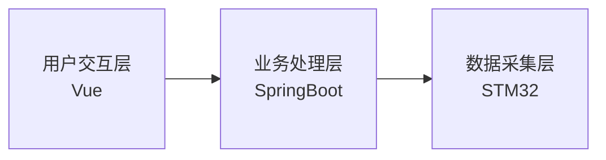

<details>
<summary><b>用户交互层模块</b></summary>

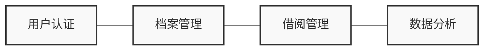
</details>

<details>
<summary><b>业务处理层模块</b></summary>

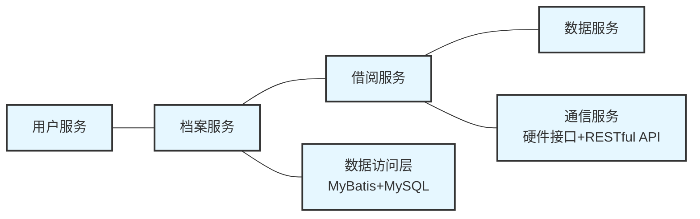
</details>

<details>
<summary><b>数据采集层模块</b></summary>

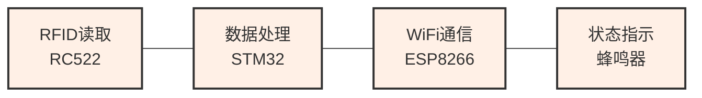
</details>

</details>

<details>
<summary><b>组件交互流程</b></summary>

以下是系统中主要组件之间的交互流程：

```mermaid
%%{init: {'theme':'default', 'themeVariables': { 'fontSize': '16px', 'nodeTextPadding': 8 }}}%%
graph LR
    RFID[RFID卡] -->|RFID信号| RC522[RC522]
    RC522 -->|SPI| STM32[STM32]
    STM32 -->|UART| ESP[ESP8266]
    ESP -->|WiFi| Server[服务器]
    Server -->|HTTP请求| Spring[SpringBoot]
    Spring -->|RESTful API| Vue[Vue前端]
    
    classDef comp fill:#f4f4f4,stroke:#333,stroke-width:2px,color:#333,font-weight:bold
    RFID:::comp
    RC522:::comp
    STM32:::comp
    ESP:::comp
    Server:::comp
    Spring:::comp
    Vue:::comp
```
</details>

<details>
<summary><b>数据流向详解</b></summary>

系统数据流分为三个主要业务流程：

<details>
<summary><b>1. 档案识别流程 📝</b></summary>

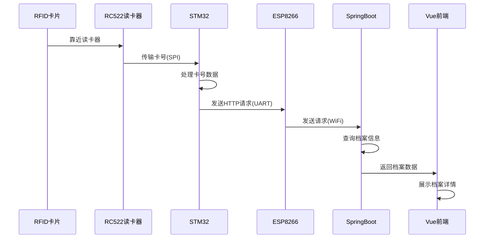
</details>

<details>
<summary><b>2. 借阅流程 📤</b></summary>

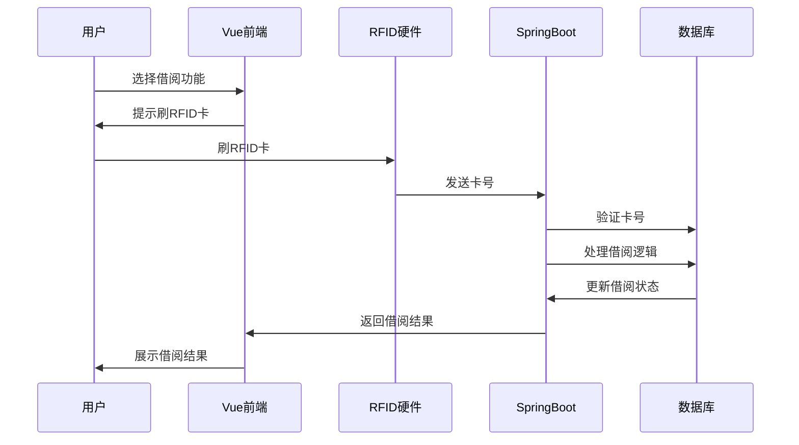
</details>

<details>
<summary><b>3. 归还流程 📥</b></summary>

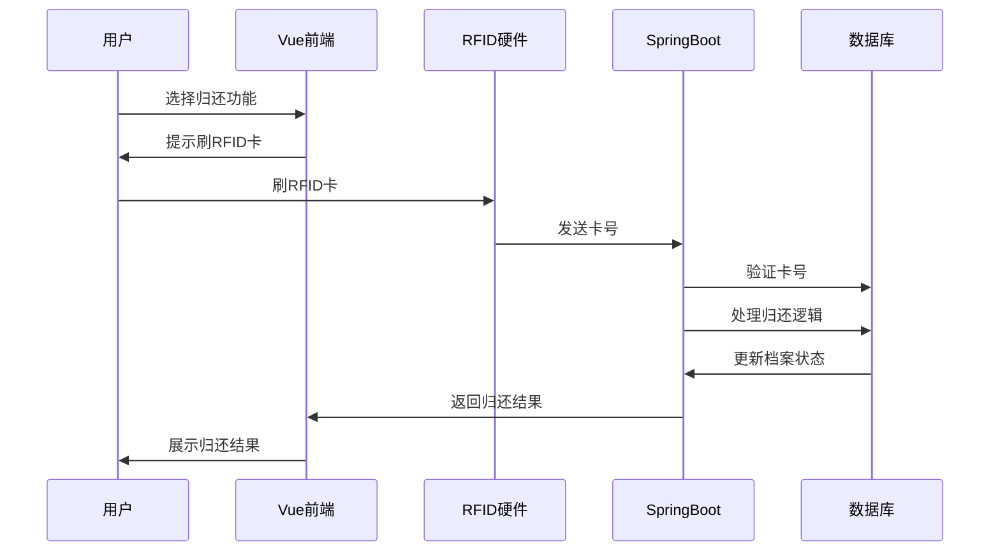
</details>

</details>

<details>
<summary><b>安全机制</b></summary>

系统采用多层次安全保障措施：

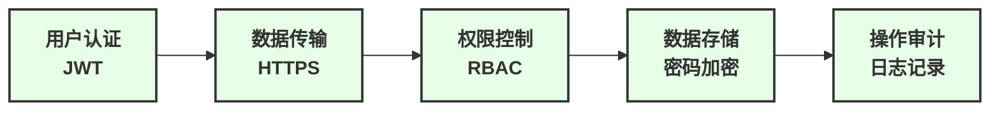
</details>

## ✨ 功能特性

<details open>
<summary><b>🔐 用户管理</b></summary>

- **用户注册与登录**
  - 基于角色的账户系统（管理员、普通用户）
  - 安全的密码存储（BCrypt加密）
  - JWT令牌认证
  - 用户会话管理

- **个人信息管理**
  - 用户基本资料维护
  - 头像上传与修改
  - 密码修改与重置

- **权限控制**
  - 基于角色的访问控制
  - 操作审计日志
  - 敏感操作二次验证
  </details>

<details>
<summary><b>📚 档案管理</b></summary>

- **档案信息录入**
  - 档案基本信息录入（名称、作者、日期等）
  - 档案分类与标签管理
  - 档案位置管理
  - RFID卡绑定

- **档案编辑与维护**
  - 档案信息批量导入/导出
  - 档案信息更新
  - 档案状态管理（在库、借出、维护中）
  - 档案封面图片上传

- **档案分类管理**
  - 多级分类体系
  - 自定义分类创建
  </details>

<details>
<summary><b>📑 借阅管理</b></summary>

- **RFID刷卡借阅**
  - 一键式借阅流程
  - 自动身份验证
  - 借阅权限检查
  - 借阅期限设置

- **借阅历史记录**
  - 个人借阅历史查询
  - 档案借阅记录查询
  - 借阅状态实时更新
  - 超期提醒

- **归还管理**
  - RFID刷卡归还
  - 归还状态确认
  - 超期费用计算
  - 归还评分（档案评价）

- **借阅规则设置**
  - 不同用户类型的借阅权限设置
  - 最大借阅数量限制
  - 借阅期限自定义
  - 超期处理规则
  </details>

<details>
<summary><b>📊 数据统计与分析</b></summary>

- **借阅数据统计**
  - 借阅量统计与趋势分析
  - 借阅周期分析
  - 逾期率分析
  - 用户借阅行为分析

- **档案使用统计**
  - 档案热度分析
  - 不同类型档案使用频率对比
  - 档案使用趋势分析

- **可视化展示**
  - 多种图表展示（柱状图、折线图、饼图等）
  - 动态数据展示
  - 数据导出功能
  </details>

<details>
<summary><b>🔄 RFID交互</b></summary>

- **RFID卡识别**
  - 实时读取RFID卡信息
  - 卡号与档案信息关联
  - 快速档案定位

- **借阅与归还**
  - 刷卡借阅
  - 刷卡归还
  - 操作结果实时反馈

- **设备管理**
  - 多设备支持
  - 设备状态监控
  - 设备配置管理
  </details>

<details>
<summary><b>⚙️ 系统管理</b></summary>

- **用户与权限管理**
  - 用户账户管理
  - 角色权限配置
  - 权限分配

- **日志管理**
  - 操作日志记录
  - 系统日志查询
  - 日志导出与分析

- **系统设置**
  - 参数配置
  - 借阅规则设置
  - 提醒规则设置
  </details>

## 🚀 后端技术栈 (SpringBoot)

<details>
<summary><b>后端架构</b></summary>


<details>
<summary><b>详细结构</b></summary>

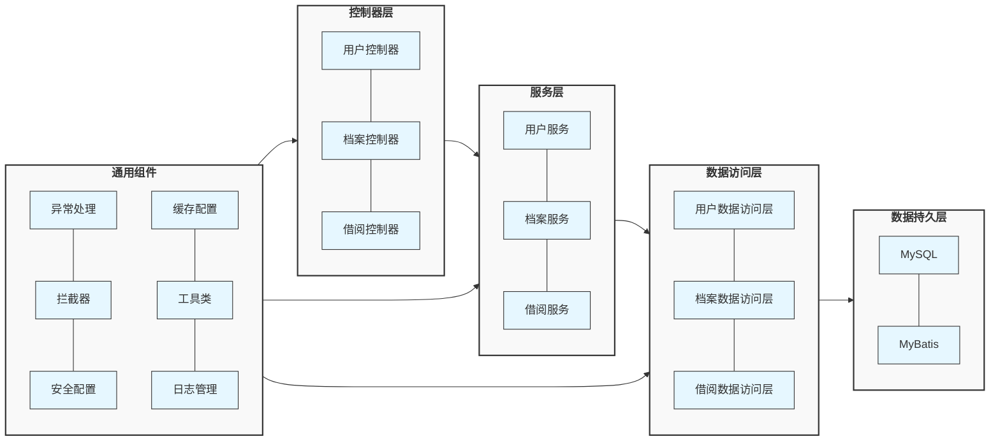
</details>

### 技术清单

<table>
<tr>
    <th>类别</th>
    <th>技术</th>
    <th>版本</th>
    <th>说明</th>
</tr>
<tr>
    <td rowspan="3">核心框架</td>
    <td>Spring Boot</td>
    <td>3.0.4</td>
    <td>应用基础框架</td>
</tr>
<tr>
    <td>Spring MVC</td>
    <td>6.0.x</td>
    <td>Web框架</td>
</tr>
<tr>
    <td>Spring Security</td>
    <td>6.0.x</td>
    <td>安全框架</td>
</tr>
<tr>
    <td rowspan="3">数据存储</td>
    <td>MySQL</td>
    <td>8.0</td>
    <td>关系型数据库</td>
</tr>
<tr>
    <td>Redis</td>
    <td>6.x</td>
    <td>缓存与会话存储</td>
</tr>
<tr>
    <td>MyBatis</td>
    <td>3.0.x</td>
    <td>ORM框架</td>
</tr>
<tr>
    <td rowspan="2">安全机制</td>
    <td>JWT</td>
    <td>0.11.x</td>
    <td>无状态身份验证</td>
</tr>
<tr>
    <td>HTTPS</td>
    <td>TLS 1.3</td>
    <td>传输加密</td>
</tr>
<tr>
    <td rowspan="2">微服务</td>
    <td>Spring Cloud</td>
    <td>2022.0.x</td>
    <td>微服务基础框架</td>
</tr>
<tr>
    <td>Nacos</td>
    <td>2.2.x</td>
    <td>服务注册与配置中心</td>
</tr>
</table>
</details>

<details>
<summary><b>核心API</b></summary>

### 重要接口

| 模块 | 接口 | 方法 | 说明 |
|------|------|------|------|
| 用户管理 | `/user/login` | GET | 用户登录认证 |
| 用户管理 | `/auth/info` | GET | 获取用户信息 |
| 用户管理 | `/auth/logout` | POST | 用户登出 |
| RFID交互 | `/user/puttRfid` | GET | 接收RFID卡号 |
| RFID交互 | `/auth/book/rfid/getRfid` | GET | 获取最新RFID卡号 |
| 档案管理 | `/auth/book/info/getBookInfoCreatList` | GET | 获取档案创建列表 |
| 档案管理 | `/auth/book/info/addBookInfo` | GET | 添加档案信息 |
| 借阅管理 | `/auth/book/borrow/borrowBook` | GET | 借阅档案 |
| 借阅管理 | `/auth/book/borrow/returnBook` | GET | 归还档案 |
| 统计分析 | `/auth/echart/getBookTypeInfoChart` | GET | 获取档案类型统计 |
| 统计分析 | `/auth/echart/getUserInfoChart` | GET | 获取用户信息统计 |
</details>

## 💾 数据库设计

<details open>
<summary><b>ER图设计</b></summary>

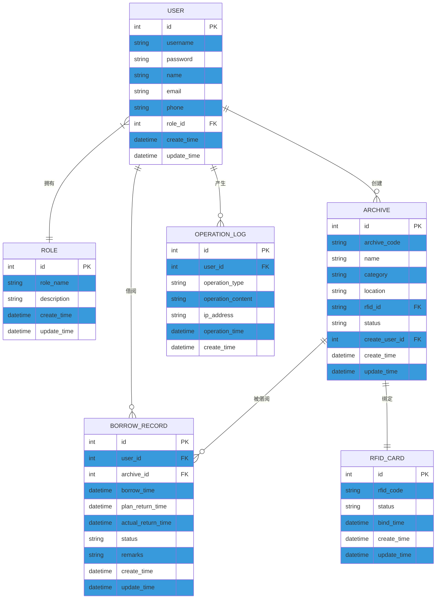
</details>

<details>
<summary><b>表结构说明</b></summary>

### 核心表说明

1. **用户表(USER)**
   - 存储系统用户基本信息
   - 与角色表(ROLE)建立关联，实现RBAC权限控制

2. **角色表(ROLE)**
   - 定义系统角色与权限
   - 包括管理员、档案管理员、普通用户等角色

3. **档案表(ARCHIVE)**
   - 存储档案基本信息
   - 与RFID_CARD表关联，实现RFID标签与档案绑定

4. **RFID卡表(RFID_CARD)**
   - 管理所有RFID标签信息
   - 记录标签使用状态与绑定时间

5. **借阅记录表(BORROW_RECORD)**
   - 记录档案借阅和归还信息
   - 关联用户和档案信息，完整记录借阅周期

6. **操作日志表(OPERATION_LOG)**
   - 记录系统重要操作
   - 用于安全审计和问题追踪
</details>

## 🛠️ 硬件技术栈 (STM32)

<details>
<summary><b>硬件架构</b></summary>

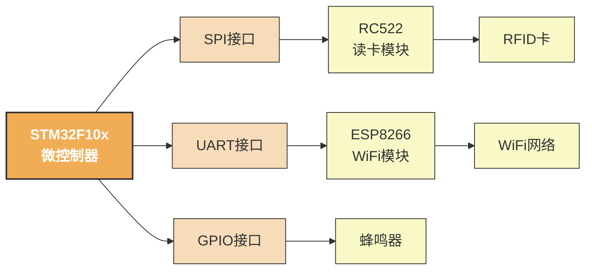
</details>

<details>
<summary><b>硬件组件</b></summary>

### 主要硬件组件

<table>
<tr>
    <th>组件</th>
    <th>型号</th>
    <th>参数</th>
    <th>功能</th>
</tr>
<tr>
    <td>微控制器</td>
    <td>STM32F103C8T6</td>
    <td>
      - 72MHz主频<br/>
      - 64KB Flash<br/>
      - 20KB SRAM
    </td>
    <td>系统核心处理单元</td>
</tr>
<tr>
    <td>RFID读卡模块</td>
    <td>RC522</td>
    <td>
      - 13.56MHz<br/>
      - SPI接口<br/>
      - 3.3V供电
    </td>
    <td>读取RFID卡片信息</td>
</tr>
<tr>
    <td>WiFi模块</td>
    <td>ESP8266</td>
    <td>
      - 802.11 b/g/n<br/>
      - UART接口<br/>
      - 3.3V供电
    </td>
    <td>数据无线传输</td>
</tr>
<tr>
    <td>声音提示</td>
    <td>蜂鸣器</td>
    <td>
      - 有源蜂鸣器<br/>
      - GPIO控制<br/>
      - 5V供电
    </td>
    <td>提供声音反馈</td>
</tr>
</table>

### 连接图

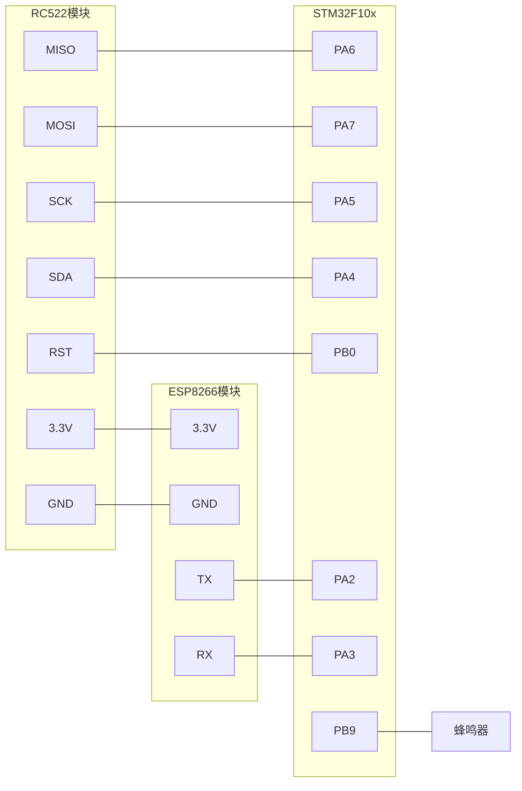
</details>

<details>
<summary><b>STM32程序架构</b></summary>

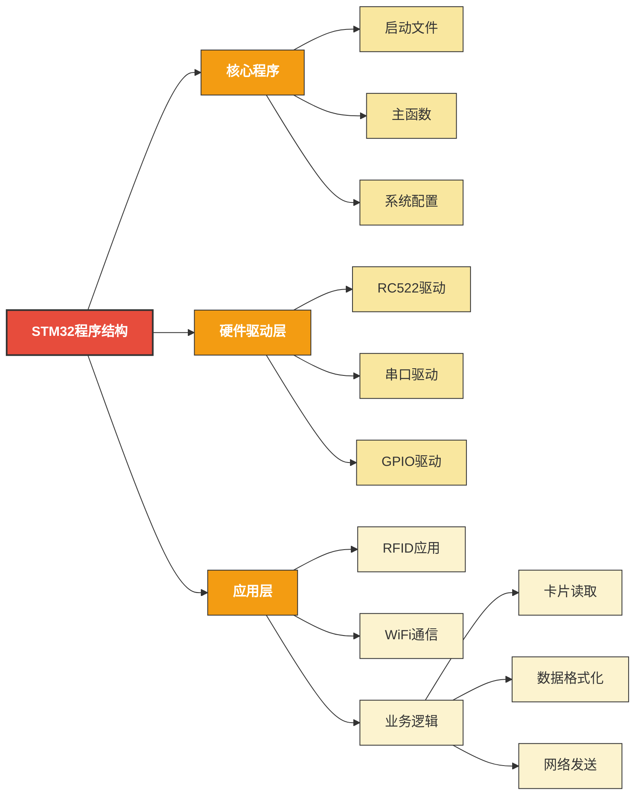

</details>

## 💻 前端技术栈 (Vue)

<details>
<summary><b>前端技术栈</b></summary>

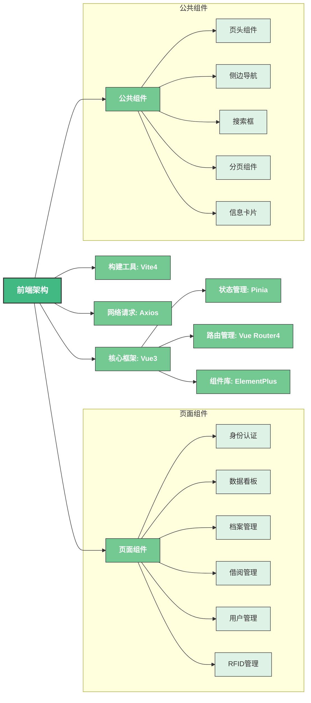
</details>

### 用户登录流程

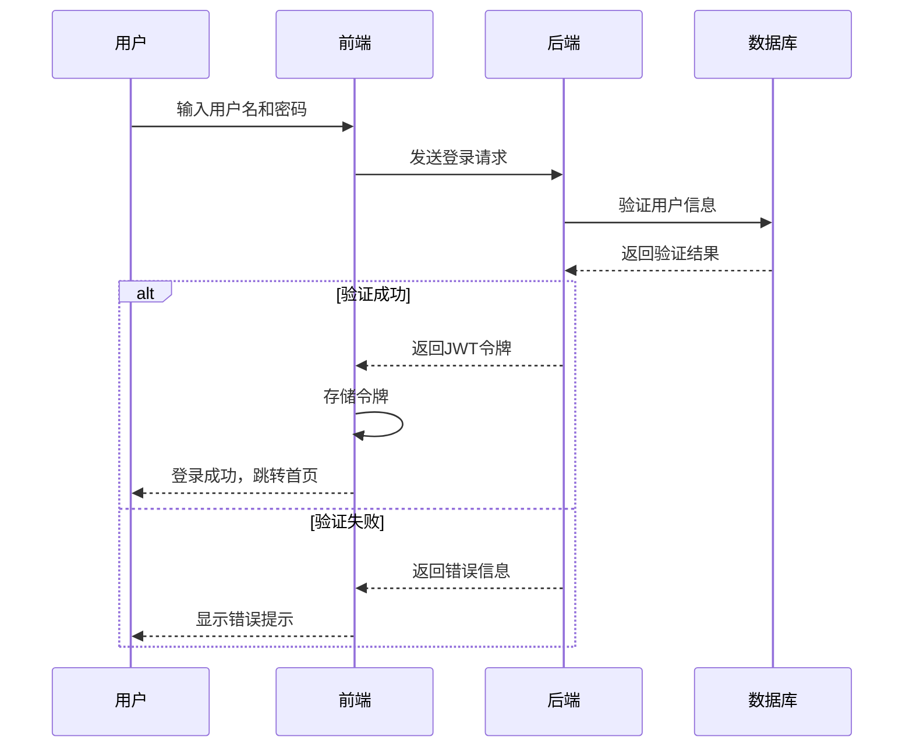

### 借阅流程

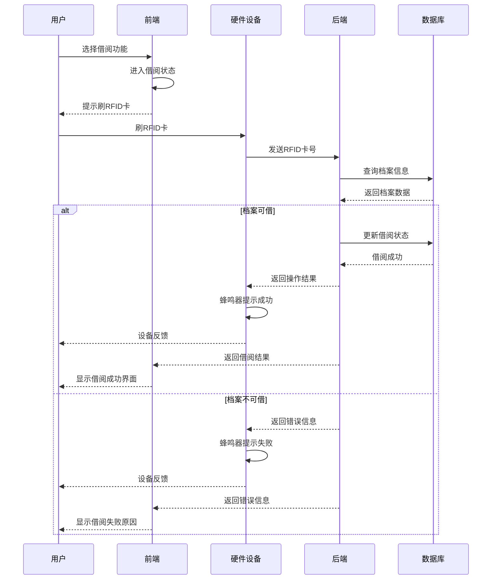

### 状态管理流程

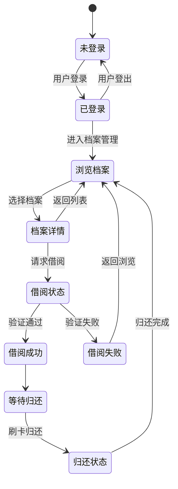

## 🚀 快速开始

<details>
<summary><b>环境要求</b></summary>

### 开发环境

- JDK 17+
- Node.js 16+
- MySQL 8.0+
- Redis 6.x+
- Nacos 2.2.x
- STM32 开发环境（Keil MDK或STM32CubeIDE）
- Vue.js 开发环境

### 运行环境

- 服务器：Linux/Windows
- 前端：现代浏览器（Chrome, Firefox, Edge等）
- 硬件：STM32F103C8T6开发板
</details>

<details>
<summary><b>安装步骤</b></summary>

### 1. 克隆项目

```bash
# 克隆项目
git clone https://github.com/EncounterXin/RFID-Archive-Management-System.git

# 进入项目目录
cd RFID-Archive-Management-System
```### 2. 后端部署

```bash
# 进入SpringBoot目录
cd SpringBoot

# 使用Maven构建项目
mvn clean package -DskipTests

# 运行项目
java -jar target/RFID-Archive-Management-System-0.0.1-SNAPSHOT.jar
```

### 3. 前端部署

```bash
# 进入Vue目录
cd ../VUE

# 安装依赖
npm install

# 开发环境运行
npm run dev

# 生产环境构建
npm run build
```

### 4. 硬件配置

1. 使用Keil MDK打开STM目录下的项目
2. 编译代码并烧录到STM32开发板
3. 连接RC522模块和ESP8266模块
4. 修改WiFi连接参数 (wifi.c)
5. 上电运行
</details>

<details>
<summary><b>数据库配置</b></summary>

### MySQL配置

1. 创建数据库
```sql
CREATE DATABASE rams DEFAULT CHARACTER SET utf8mb4 COLLATE utf8mb4_unicode_ci;
```

2. 执行SQL脚本
```bash
# 使用项目提供的SQL文件
mysql -u username -p rams < .static/database/rams.sql
```
3. 修改配置文件 nacos 中的数据库连接信息

### Redis配置

1. 确保Redis服务已启动

2. 修改配置文件 nacos 中的Redis连接信息
</details>

<details>
<summary><b>Nacos配置</b></summary>

项目使用Nacos作为配置中心和服务注册中心，`.static/nacos_config_20250508_1.0.0`目录包含了预配置的Nacos配置信息。

### 环境配置

提供了多种环境的配置：
- **DEV** - 开发环境配置
- **LOCAL** - 本地测试环境配置
- **PROD** - 生产环境配置
- **SHARED** - 共享配置

### 导入配置

1. 安装并启动Nacos服务器
```bash
# 下载Nacos
wget https://github.com/alibaba/nacos/releases/download/2.2.3/nacos-server-2.2.3.zip
unzip nacos-server-2.2.3.zip
cd nacos/bin

# 启动Nacos
sh startup.sh -m standalone  # Linux/Mac
startup.cmd -m standalone    # Windows
```

2. 访问Nacos控制台 `http://localhost:8848/nacos`，默认账号密码: nacos/nacos

3. 通过Nacos控制台导入`.static/nacos_config_20250508_1.0.0`目录下的配置，或使用Nacos API进行配置导入

### 配置应用

在SpringBoot项目的`bootstrap.yaml`中配置Nacos连接信息：

```yaml
spring:
  application:
    name: RFID-Archive-Management-System
  cloud:
    nacos:
      discovery:
        server-addr: 127.0.0.1:8848
      config:
        server-addr: 127.0.0.1:8848
        file-extension: yaml
        prefix: ${spring.application.name}
        group: DEFAULT_GROUP
```
</details>

## 📸 系统部分功能截图

<div align="center">
<br/><center>登录页面</center><br/>
<br/><center>首页</center><br/>
<br/><center>用户管理</center><br/>
<br/><center>用户借阅</center><br/>
<br/><center>档案管理</center><br/>
<br/><center>图表展示</center>
</div><br/>

## 📞 联系方式

- **作者**: Encounter
- **邮箱**: 
    - encounterxin@gmail.com
    - encounterdx@foxmail.com
- **GitHub**: [EncounterXin](https://github.com/EncounterXin)

## 📄 许可协议

本项目采用 [Apache License 2.0](LICENSE) 协议开源。

<details>
<summary><b>查看许可协议详情</b></summary>

```
Copyright [2025] [Encounter]

Licensed under the Apache License, Version 2.0 (the "License");
you may not use this file except in compliance with the License.
You may obtain a copy of the License at

    http://www.apache.org/licenses/LICENSE-2.0

Unless required by applicable law or agreed to in writing, software
distributed under the License is distributed on an "AS IS" BASIS,
WITHOUT WARRANTIES OR CONDITIONS OF ANY KIND, either express or implied.
See the License for the specific language governing permissions and
limitations under the License.
```
</details>

<div align="center">


**RFID档案管理系统 | © 2025 Encounter. 保留所有权利**
</div>


