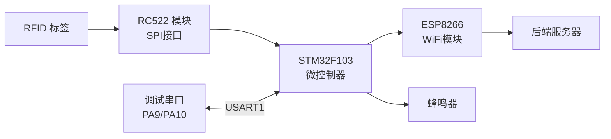
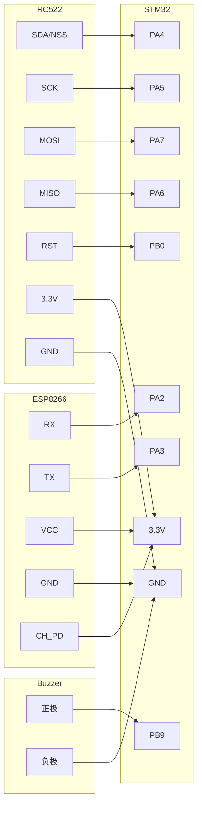
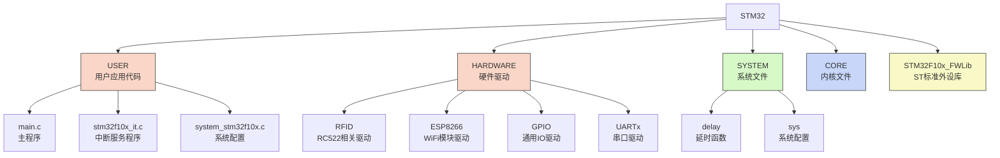

# 🔌 RFID档案管理系统 - 硬件部分

<div align="center">


</div>

## 📋 目录

- [项目概述](#-项目概述)
- [硬件架构](#-硬件架构)
- [软件架构](#-软件架构)
- [硬件接线详情](#-硬件接线详情)
- [功能模块说明](#-功能模块说明)
- [通信协议](#-通信协议)
- [代码结构](#-代码结构)
- [编译与烧录](#-编译与烧录)
- [测试流程](#-测试流程)
- [常见问题](#-常见问题)
- [维护与升级](#-维护与升级)

## 📝 项目概述

<details open>
<summary><b>系统简介</b></summary>

RFID档案管理系统硬件部分基于STM32F103C8T6微控制器开发，集成了RC522 RFID读卡模块和ESP8266 WiFi模块，实现了RFID标签的读取、识别和通过WiFi与服务器通信的功能。本系统可以实时采集RFID标签信息，并将数据传输至后端服务器，是整个档案管理系统的数据采集端。
</details>

<details>
<summary><b>主要特点</b></summary>

- 🔋 低功耗设计，适合长时间运行
- 🔍 稳定可靠的RFID卡片识别
- 🔖 支持多种类型的RFID卡片（ISO14443A）
- 📡 WiFi无线连接，便于布置和安装
- 🔊 声音反馈提醒用户操作状态
- 🖥️ 支持串口调试和远程监控
</details>

## 🛠️ 硬件架构

<details open>
<summary><b>系统组件</b></summary>

系统采用模块化设计，主要包含以下硬件模块：

### 核心控制单元
- **微控制器**：STM32F103C8T6 (ARM Cortex-M3, 72MHz)
- **存储**：64KB Flash，20KB SRAM
- **工作电压**：3.3V

### 通信模块
- **RFID读卡器**：RC522 (13.56MHz)
- **WiFi模块**：ESP8266 (802.11 b/g/n)

### 外围设备
- **蜂鸣器**：提供声音反馈
- **调试接口**：串口接口(USART1)
</details>

<details>
<summary><b>系统框图</b></summary>


</details>

## 💻 软件架构

<details open>
<summary><b>分层设计</b></summary>

系统软件采用分层架构设计，主要包括：

### 1. 硬件抽象层 (HAL)
- 直接与硬件交互的驱动程序
- 包括GPIO、SPI、USART等底层驱动

### 2. 设备驱动层
- RC522驱动：实现RFID读卡器控制
- ESP8266驱动：实现WiFi通信
- 蜂鸣器控制：实现声音反馈

### 3. 应用层
- 主程序逻辑
- 状态管理
- 数据处理与通信
</details>

<details>
<summary><b>工作流程</b></summary>

1. **初始化阶段** 🚀
   - 系统上电或复位
   - 初始化外设（串口、SPI、GPIO）
   - 初始化RC522模块和ESP8266模块
   - 蜂鸣器短鸣表示初始化完成

2. **卡片检测阶段** 🔍
   - 循环检测RFID卡片
   - 发现卡片后读取卡片ID和类型
   - 蜂鸣器鸣响表示卡片读取成功

3. **数据传输阶段** 📤
   - 将卡片信息通过ESP8266发送到服务器
   - 接收服务器响应
   - 根据响应执行相应操作

4. **状态监控阶段** 📊
   - 定期向服务器发送心跳包
   - 监控系统运行状态
   - 处理异常情况
</details>

## 🔌 硬件接线详情

<details open>
<summary><b>连接图</b></summary>



### 1. STM32与RC522模块接线

| RC522引脚 | STM32引脚 | 说明 |
|----------|----------|------|
| SDA(NSS) | PA4      | 片选信号 |
| SCK      | PA5      | 时钟信号 |
| MOSI     | PA7      | 主机输出 |
| MISO     | PA6      | 主机输入 |
| IRQ      | 悬空     | 中断请求 |
| GND      | GND      | 接地     |
| RST      | PB0      | 复位     |
| 3.3V     | 3.3V     | 电源     |

### 2. STM32与ESP8266 WiFi模块接线

| ESP8266引脚 | STM32引脚 | 说明 |
|------------|----------|------|
| RX         | PA2      | STM32 TX连接到ESP8266 RX |
| TX         | PA3      | STM32 RX连接到ESP8266 TX |
| VCC        | 3.3V     | 电源 |
| GND        | GND      | 接地 |
| CH_PD      | 3.3V     | 使能引脚，接高电平 |

### 3. STM32与蜂鸣器接线

| 蜂鸣器引脚 | STM32引脚 | 说明 |
|--------|----------|------|
| 正极(+) | PB9      | 通过驱动电路连接 |
| 负极(-) | GND      | 接地 |
</details>

## 📋 功能模块说明

<details open>
<summary><b>核心模块功能</b></summary>

### RC522 RFID模块

RC522是一款高集成度的非接触式读写卡芯片，工作频率为13.56MHz。本系统中主要用于读取RFID标签的唯一ID，支持ISO14443A标准的各类卡片。

**主要功能**：
- 读取卡片序列号（UID）
- 卡片类型识别
- 防冲突检测
- 数据完整性校验

### ESP8266 WiFi模块

ESP8266是一款低成本、高集成度的WiFi芯片，本系统使用其通过HTTP协议与后端服务器通信。

**主要功能**：
- 连接指定WiFi网络
- 发送HTTP请求
- 接收服务器响应
- 上传RFID卡片信息

### 蜂鸣器模块

系统使用蜂鸣器提供声音反馈，帮助用户了解系统运行状态和操作结果。

**工作模式**：
- 开机初始化：短鸣一声
- 读卡成功：鸣响一声
- 数据上传成功：连续短鸣两声
- 错误提示：长鸣一声
</details>

## 📡 通信协议

<details>
<summary><b>RFID通信</b></summary>

系统通过SPI接口与RC522模块通信，主要命令包括：

- `PCD_Request`：寻卡
- `PCD_Anticoll`：防冲突
- `PCD_Select`：选卡
- `PCD_AuthState`：验证密钥
- `PCD_ReadBlock`：读块数据
- `PCD_WriteBlock`：写块数据
</details>

<details>
<summary><b>WiFi通信</b></summary>

系统使用AT指令集与ESP8266模块通信，主要实现HTTP GET请求：

**HTTP请求格式**：
```
GET http://{服务器IP}:{端口}/{接口路径}?cardId={卡号}&deviceId={设备ID} HTTP/1.1\r\n
Host: {服务器IP}\r\n
Connection: keep-alive\r\n
\r\n
```

**服务器响应格式**：
```json
{
  "code": 200,
  "message": "success",
  "data": {
    "status": 1,
    "cardInfo": {
      "id": "123456789",
      "type": "ISO14443A"
    }
  }
}
```
</details>

## 📁 代码结构

<details open>
<summary><b>目录结构</b></summary>

项目采用模块化设计，代码组织结构如下：


</details>

<details>
<summary><b>主要函数说明</b></summary>

**main.c**
- `init()`：系统初始化，包括外设、模块初始化
- `main()`：主循环，处理卡片检测和数据传输

**rc522.c**
- `RC522_Init()`：初始化RC522模块
- `RC522_Handel()`：处理RFID卡片读取
- `ReadCardID()`：读取卡片ID

**wifi.c**
- `ESP_INIT()`：初始化ESP8266模块
- `connectWifi()`：连接WiFi网络
- `sendHttpRequest()`：发送HTTP请求

**gpio.c**
- `BUZZER_INIT()`：初始化蜂鸣器
- `BUZZER_ON()`：打开蜂鸣器
- `BUZZER_OFF()`：关闭蜂鸣器
- `BUZZER_BEEP()`：蜂鸣器鸣响指定次数和时长
</details>

## 🔧 编译与烧录

<details>
<summary><b>开发环境</b></summary>

- **IDE**：Keil MDK 5.x
- **编译器**：ARMCC
- **调试器**：JLINK/STLINK
</details>

<details>
<summary><b>编译步骤</b></summary>

1. 打开Keil MDK，加载项目文件 `USER/USART.uvprojx`
2. 选择正确的目标设备（STM32F103C8）
3. 设置合适的编译选项（优化级别、警告级别等）
4. 点击"Build"按钮进行编译
</details>

<details>
<summary><b>烧录方法</b></summary>

#### 使用STLINK

1. 连接STLINK到STM32的SWD接口
2. 在Keil MDK中选择"Flash->Download"
3. 等待烧录完成

#### 使用串口烧录

1. 将STM32设置为BOOT0=1，BOOT1=0
2. 连接串口到USART1
3. 使用STM32 Flash Loader工具烧录hex文件
4. 烧录完成后设置BOOT0=0，BOOT1=0并复位
</details>

## 🔍 测试流程

<details>
<summary><b>基础功能测试</b></summary>

1. **串口通信测试**：
   - 通过串口调试助手查看串口输出
   - 波特率：115200
   - 正常情况下会输出初始化信息

2. **蜂鸣器测试**：
   - 系统启动时蜂鸣器应短鸣一声
   - 读卡成功时蜂鸣器应鸣响

3. **RFID卡片测试**：
   - 将RFID卡片靠近RC522模块
   - 串口会输出卡片ID和类型
   - 示例输出：`Card ID: 0F 34 56 78, Type: ISO14443A`

4. **WiFi模块测试**：
   - 通过AT指令测试ESP8266响应
   - 检查是否能连接到指定WiFi网络 
   - 测试HTTP请求是否成功
</details>

<details>
<summary><b>系统集成测试</b></summary>

1. **完整流程测试**：
   - 启动系统，观察初始化过程
   - 使用RFID卡片测试读卡功能
   - 检查数据是否成功上传到服务器
   - 观察服务器响应处理

2. **稳定性测试**：
   - 长时间运行系统（24小时以上）
   - 定期检查系统状态
   - 测试高频读卡场景
   - 测试网络不稳定场景
</details>

## ❓ 常见问题

<details>
<summary><b>硬件问题</b></summary>

1. **RC522无法读取卡片**
   - 检查SPI连接是否正确
   - 确认卡片类型是否支持
   - 检查RC522供电是否稳定

2. **ESP8266无法连接WiFi**
   - 检查WiFi名称和密码是否正确
   - 确认ESP8266供电是否足够（≥300mA）
   - 检查AT指令响应是否正常

3. **蜂鸣器不工作**
   - 检查接线是否正确
   - 确认驱动电路是否正常
   - 检查GPIO是否配置为输出模式

4. **系统不稳定或重启**
   - 检查电源供电是否稳定
   - 排除硬件干扰因素
   - 检查程序异常处理机制
</details>

<details>
<summary><b>软件问题</b></summary>

1. **编译错误**
   - 检查依赖库是否完整
   - 确认编译选项是否正确
   - 查看具体错误消息并对应修复

2. **通信超时**
   - 检查网络连接状态
   - 确认服务器是否正常运行
   - 增加超时重试机制

3. **数据解析错误**
   - 检查数据格式是否符合预期
   - 确认字节顺序是否正确
   - 增强错误处理和容错机制
</details>

## 🔄 维护与升级

<details>
<summary><b>日常维护</b></summary>

- 定期检查硬件连接是否牢固
- 监控系统运行日志
- 保持设备清洁，避免灰尘积累
- 定期更新WiFi密码等安全信息
</details>

<details>
<summary><b>升级建议</b></summary>

- **硬件升级**：
  - 考虑使用更高性能的STM32F4系列
  - 升级到ESP32以获得更好的WiFi性能
  - 添加备用电源以提高可靠性

- **软件升级**：
  - 增加加密机制提高安全性
  - 优化电源管理延长设备寿命
  - 添加OTA功能支持远程更新
  - 实现数据本地缓存，提高离线可靠性
</details>

<div align="center">


**RFID档案管理系统 - 硬件部分 | © 2025 Encounter. 保留所有权利**
</div> 